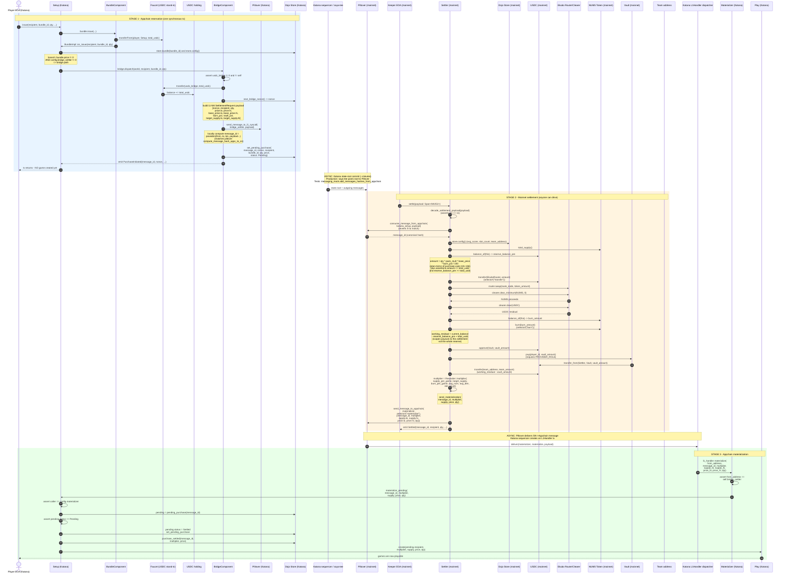
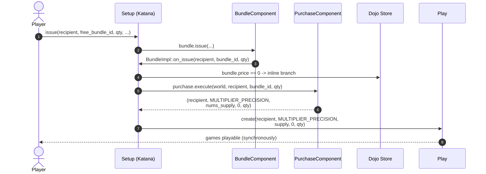
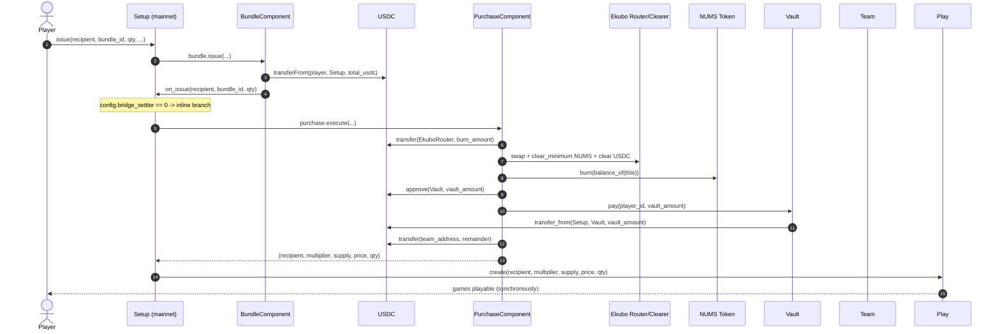

# Nums Cross-Chain Bridge Architecture

Players play Nums on a Katana appchain so that turns are cheap and instant, but value capture (NUMS supply burn, USDC vault payouts, team treasury) lives on Starknet mainnet where the canonical NUMS token, the Ekubo NUMS/USDC pool, and the Vault all already exist. Each paid pack purchase therefore turns into a Piltover message round-trip: Katana parks the player's USDC and asks mainnet to do the economic work; mainnet executes the same swap+burn+vault.pay flow that the inline `purchase.execute` path uses, then sends a reverse Piltover message that unlocks the actual `Play.create(...)` call on Katana.

The four contracts that together implement this round-trip are:

- **Setup** (Katana) — receives the `issue` call, owns the `BridgeComponent`, persists `PendingPurchase` records, and is the only contract authorised to call `Play.create`.
- **Settler** (mainnet) — consumes the appchain message, sources USDC from its own reserve, replays the swap+burn+vault flow, and sends the reverse message.
- **Materializer** (Katana, plain Starknet contract) — owns the `#[l1_handler]` entry point and is the single authorised caller of `Setup.materialize_pending`.
- **BridgeComponent** (embedded in Setup) — does the actual `send_message_to_l1_syscall` and `PendingPurchase` bookkeeping.

The rest of this document walks the deployed topology, the happy-path call graph, and the divergent flows.

---

## 1. Component map

What this shows: every deployed contract and which contracts call which, grouped by chain. The Piltover "messaging plane" in the middle is the only allowed cross-chain edge — no contract on either side directly references an address on the other chain except through a Piltover send/consume call.

```mermaid
graph TB
  subgraph Katana["Katana appchain"]
    direction TB
    K_Player[Player EOA]
    K_Setup[Setup<br/>dojo::contract]
    K_Bridge[BridgeComponent<br/>embedded in Setup]
    K_Purchase[PurchaseComponent<br/>embedded in Setup]
    K_Bundle[BundleComponent<br/>embedded in Setup]
    K_Materializer[Materializer<br/>plain starknet::contract]
    K_Play[Play]
    K_Token[NUMS Token<br/>fresh appchain mint]
    K_Vault[Vault<br/>stub / unused]
    K_Faucet[Faucet<br/>USDC stand-in]
    K_USDCBridge[USDC holding contract<br/>config.usdc_bridge]
    K_Piltover[Piltover messaging<br/>config.bridge_messaging]
  end

  subgraph Bridge["Piltover messaging plane (cross-chain)"]
    P_AppToSn[("Appchain to SN<br/>SettlementRequest payload<br/>11 felts")]
    P_SnToApp[("SN to Appchain<br/>MaterializationResult payload<br/>7 felts<br/>selector!('materialize')")]
  end

  subgraph Mainnet["Starknet mainnet"]
    direction TB
    M_Settler[Settler<br/>dojo::contract]
    M_Setup[Setup<br/>existing, no bridge_settler]
    M_Purchase[PurchaseComponent<br/>existing inline path]
    M_Vault[Vault]
    M_Token[NUMS Token<br/>canonical]
    M_USDC[USDC]
    M_Treasury[Treasury<br/>ADMIN_ROLE holder]
    M_Ekubo[Ekubo Router + Clearer]
    M_Pool[Ekubo NUMS/USDC pool<br/>+ Positions extension]
    M_Team[Team address<br/>config.team_address]
    M_Piltover[Piltover messaging<br/>core contract]
  end

  K_Player -->|issue bundle_id, qty| K_Setup
  K_Setup --> K_Bundle
  K_Bundle -->|on_issue callback| K_Setup
  K_Setup -->|bundle.price 0 OR no bridge_settler| K_Purchase
  K_Setup -->|paid bundle and bridge_settler set| K_Bridge
  K_Bundle -->|transferFrom player| K_Faucet
  K_Bridge -->|transfer total_usdc| K_Faucet
  K_Faucet -->|park USDC| K_USDCBridge
  K_Bridge -->|send_message_to_l1_syscall| K_Piltover
  K_Bridge -->|set_pending_purchase| K_Setup

  K_Piltover --> P_AppToSn
  P_AppToSn --> M_Piltover

  M_Settler -->|consume_message_from_appchain| M_Piltover
  M_Settler -->|transfer burn_amount| M_USDC
  M_USDC -->|swap quote in| M_Ekubo
  M_Ekubo -->|clear_minimum NUMS| M_Settler
  M_Settler -->|burn| M_Token
  M_Settler -->|approve then pay| M_Vault
  M_Vault -->|transferFrom| M_USDC
  M_Settler -->|transfer remainder| M_Team
  M_Treasury -->|deposit_reserve / withdraw_reserve / setters| M_Settler
  M_Settler -->|"send_message_to_appchain<br/>selector!('materialize')"| M_Piltover

  M_Piltover --> P_SnToApp
  P_SnToApp --> K_Piltover
  K_Piltover -->|l1_handler tx| K_Materializer
  K_Materializer -->|materialize_pending| K_Setup
  K_Setup -->|create| K_Play

  M_Setup -.purchase.execute inline.- M_Purchase
  M_Purchase -.swap+burn+pay synchronously.- M_Ekubo
```

Notes on the diagram:

- **`K_Vault`** is drawn dashed-lightly because the appchain Vault is intentionally unused for paid bundles — value moves through the mainnet Vault instead.
- **Treasury** holds `ADMIN_ROLE` and `DEFAULT_ADMIN_ROLE` on the mainnet Settler (granted in `Settler.dojo_init` lines 209-213). The deployer account is also granted these roles for test-driven post-deploy setters.
- The appchain `usdc_bridge` is just a holding address; in production it is the same canonical USDC bridge; in tests it is a separate stand-in. The bridge does **not** atomically settle USDC across chains — settlement of the actual stablecoin is out of scope of this contract bundle and assumed to happen via the existing Cartridge USDC bridge.

---

## 2. Happy-path purchase to game-ready

What this shows: every contract call from the moment a player calls `Setup.issue(bundle_id, qty, ...)` on Katana to the moment `Play.create` runs and the player can play. Selectors are inlined where they aid traceability. Three coloured stages: **appchain reservation** (synchronous in the player's tx), **mainnet settlement** (later, driven by a keeper), **appchain materialization** (later still, driven by Katana's L1Handler dispatcher).



Key things to notice:

- The player's transaction (Stage 1) **commits no economic state on mainnet**; it only parks USDC on the appchain and writes a `PendingPurchase` row. If mainnet never executes Stage 2, the appchain admin can use `admin_settle` (see Section 3) to refund the player with games minted at fallback multiplier.
- `consume_message_from_appchain` (step 24) is the replay/forgery gate. The Settler does not trust `payload` until Piltover has matched it against an unconsumed appchain message.
- The appchain `BridgeComponent` re-derives `message_id` locally with the same poseidon formula Piltover uses, so `Settled.message_id` (mainnet event) and `PendingPurchase.message_id` (appchain row) are guaranteed to match without coordination.

---

## 3. Alternate paths

### 3a. Free bundle on Katana (no bridge)

What this shows: when `bundle.price == 0`, `BundleImpl::on_issue` short-circuits to the inline `purchase.execute` path even on the appchain. No Piltover round-trip, games created in the same transaction.



The same path is taken on mainnet for **any** bundle when `config.bridge_settler == 0` — see Section 3c.

### 3b. Admin escape hatch: `Setup.admin_settle`

What this shows: when the mainnet Settler is permanently broken (or the keeper never runs), an admin can mark a `PendingPurchase` as `Cancelled` on the appchain and mint fallback games at `MULTIPLIER_PRECISION`. The mainnet message remains consumable; if it ever later settles, the reverse Materialization message will revert at the `status == Pending` check.

```mermaid
sequenceDiagram
    autonumber
    actor Admin as Admin (ADMIN_ROLE)
    participant K_Setup as Setup (Katana)
    participant K_Store as Dojo Store
    participant K_Play as Play
    participant M_Piltover as Piltover (mainnet)
    participant M_Settler as Settler (mainnet)

    Admin->>K_Setup: admin_settle(message_id)
    K_Setup->>K_Setup: assert ADMIN_ROLE
    K_Setup->>K_Store: pending = pending_purchase(message_id)
    K_Setup->>K_Setup: assert pending.status == Pending
    K_Setup->>K_Store: pending.status = Cancelled<br/>set_pending_purchase
    K_Setup->>K_Store: purchase_cancelled(message_id, MULTIPLIER_PRECISION)
    K_Setup->>K_Play: create(recipient,<br/>  MULTIPLIER_PRECISION,<br/>  config.target_supply,<br/>  pending.price, pending.quantity)
    Note over K_Setup: Piltover cancellation is intentionally NOT called<br/>(only works for SN->Appchain; bridge uses Appchain->SN)<br/>Dual-spend protection comes from the Cancelled<br/>status check inside materialize_pending

    Note over M_Settler: Later (optional): keeper still runs settle(...)
    M_Settler->>M_Piltover: consume_message_from_appchain(...)<br/>SUCCEEDS (message was never consumed)
    M_Settler->>M_Piltover: send_message_to_appchain(<br/>  materializer, materialize, ...)
    Note over M_Piltover: Eventually delivered to Materializer,<br/>which calls Setup.materialize_pending,<br/>which REVERTS on assert pending.status == Pending<br/>=> player keeps the fallback games, mainnet<br/>economic side-effects (burn / vault / team transfer)<br/>still happen against the Settler reserve
```

### 3c. Mainnet inline path (no bridge)

What this shows: on mainnet, `config.bridge_settler == 0`, so `BundleImpl::on_issue` always takes the inline branch — exactly the same behaviour as today. Single transaction, no Piltover.



---

## 4. Cross-chain invariants

| # | Invariant | Source |
|---|-----------|--------|
| 1 | `message_id` correlates request and response. Computed locally by `BridgeComponent` as `poseidon_hash_span(from, to, len, payload...)`, matching `piltover::messaging::hash::compute_message_hash_appc_to_sn`. The same hash is returned by `consume_message_from_appchain` on mainnet and echoed back as the first felt of the Materialization payload. | `bridge.cairo:91-105`, `settler.cairo:251-252`, `materializer.cairo:48-71` |
| 2 | Per-Setup monotonic `nonce` ensures payload uniqueness — two identical purchases by different players produce different message hashes (otherwise Piltover's ref-count would collapse them). | `store.cairo:149-157` (`next_bridge_nonce`), used at `bridge.cairo:70-74` |
| 3 | `PendingStatus` transitions: `Pending -> Settled` (via `Materializer -> Setup.materialize_pending`) or `Pending -> Cancelled` (via `Setup.admin_settle`). No other transitions exist, so a `PendingPurchase` is consumed exactly once. | `setup.cairo:548-580` and `setup.cairo:582-620` |
| 4 | Replay protection has three independent layers: (a) Piltover ref-count on the consumed message; (b) per-sender Piltover nonce in the SN->Appchain direction blocking duplicate Materialization deliveries; (c) `assert pending.status == Pending` inside `materialize_pending`. Any one layer suffices. | `bridge.cairo:91-94`, `materializer.cairo:48-71`, `setup.cairo:567` |
| 5 | Settler decouples economic args from local `Bundle` table symmetry: `price`, `base_price`, `burn_pct`, `vault_pct`, `target_supply` all come from the **payload**, while only stable per-config knobs (`avg_score`, `slot_count`, `team_address`, Ekubo pool params, `quote` address) come from mainnet `Config`. This means the appchain can register new bundle IDs without a coordinated mainnet config update. | `settler.cairo:79-93` (decoder), `settler.cairo:228-490` (settle) |
| 6 | `usdc_bridge` sentinel guards: `BridgeComponent.dispatch` reverts if `usdc_bridge == 0` or `usdc_bridge == self`, so a misconfigured Setup cannot silently drain USDC into itself. | `bridge.cairo:55-60` |
| 7 | `from_address` check in the L1 handler: `Materializer.materialize` reverts if `from_address != self.bridge_settler`, so mainnet messages from any other contract cannot trigger `Play.create`. | `materializer.cairo:62-65` |
| 8 | Settler uses a **working budget** of `total_usdc = price * qty` reserved against its long-lived reserve, then computes `working_residual = current_balance - reserve_balance_pre + total_usdc` so vault.pay and team.transfer only consume that envelope. This is the moral equivalent of `purchase.cairo:171-193`'s "balance after clear" but scoped per-settlement. | `settler.cairo:366-450` |
| 9 | Settler has two short-circuits that bypass the Ekubo path: `price == 0` (free bundle that somehow took the bridge route) and `amount == 0` (zero burn percentage, used in the e2e test harness). Both still send the reverse Materialization message. | `settler.cairo:264-291`, `settler.cairo:311-364` |
| 10 | After deploy, the operator must grant the Settler `Vault.PROVIDER_ROLE` and `Token.burn` authorisation on mainnet — these are external prerequisites not enforced by the Settler itself. | `settler.cairo:17-20` (header doc) |

---

## 5. File pointers

- Mainnet Settler: `contracts/src/systems/settler.cairo`
- Appchain Setup: `contracts/src/systems/setup.cairo`
- BridgeComponent: `contracts/src/components/bridge.cairo`
- PurchaseComponent (inline path): `contracts/src/components/purchase.cairo`
- Materializer (l1_handler): `contracts/src/systems/materializer.cairo`
- Vault.pay: `contracts/src/systems/vault.cairo:287-301`
- NUMS burn: `contracts/src/systems/token.cairo:125-128`
- Piltover IMessaging: `contracts/src/interfaces/messaging.cairo`
- Models (Config, PendingPurchase, BridgeNonce, PendingStatus): `contracts/src/models/index.cairo`
- Store accessors: `contracts/src/store.cairo:131-213`
- Constants (`MATERIALIZE_SELECTOR`, `MULTIPLIER_PRECISION`): `contracts/src/constants.cairo:70-74`
- Mainnet init args: `dojo_mainnet.toml`
- Appchain init args: `dojo_katana.toml`
